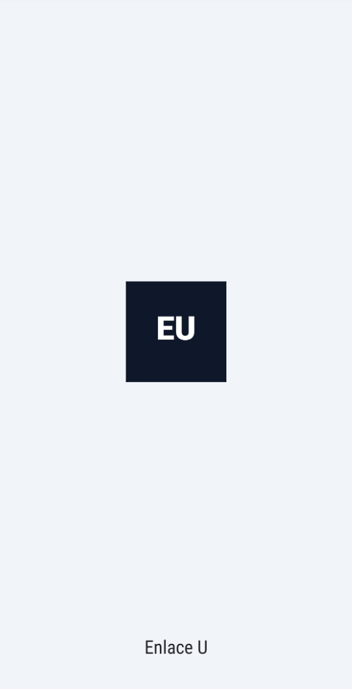
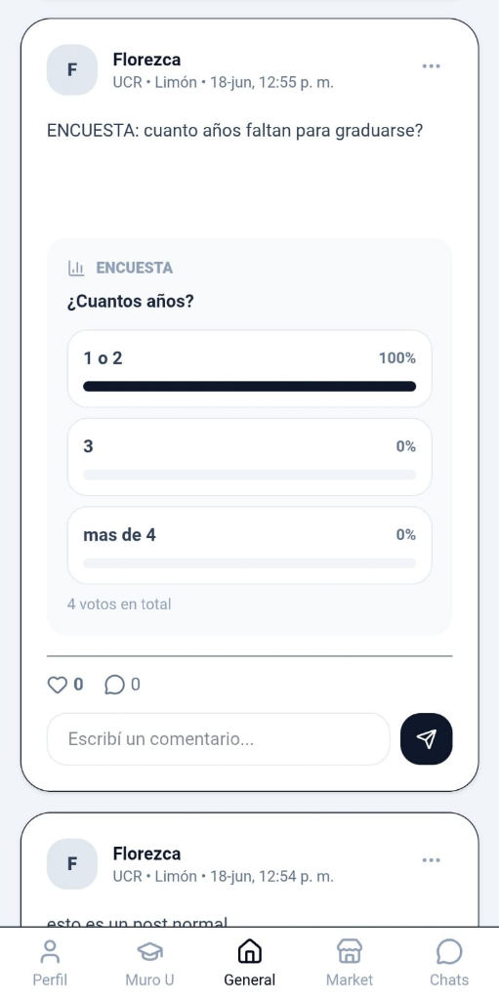
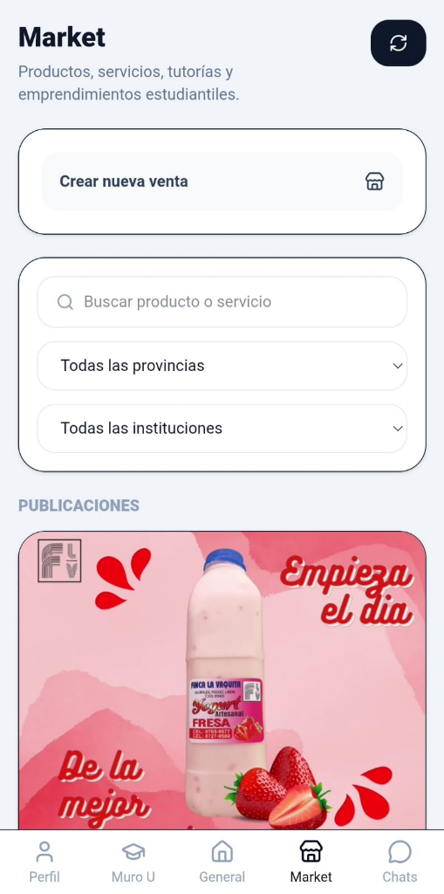
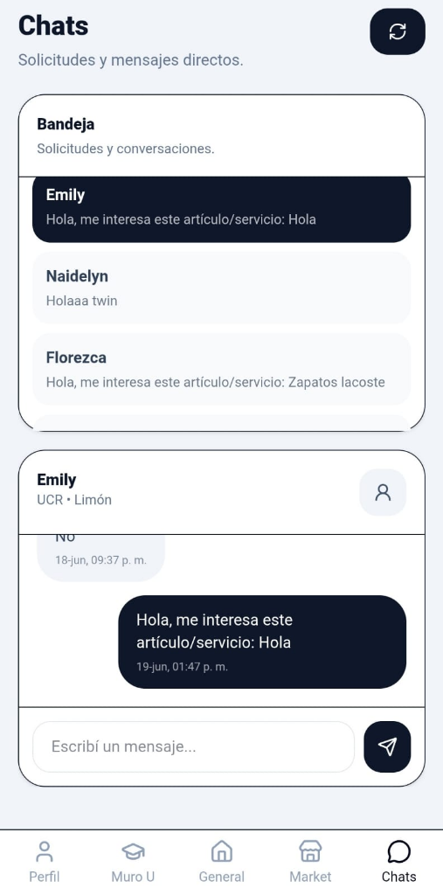
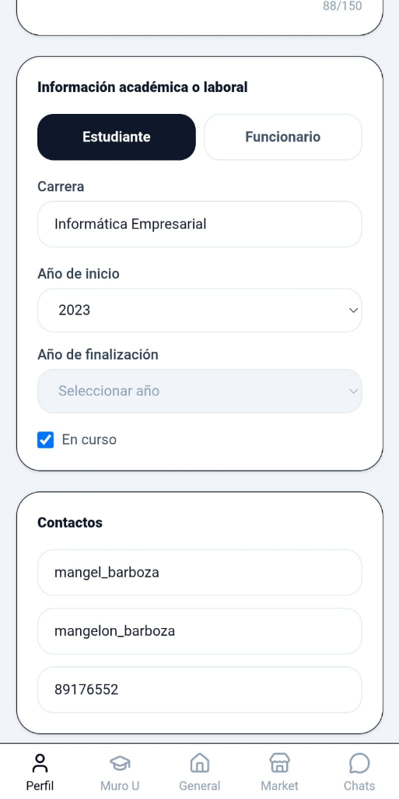
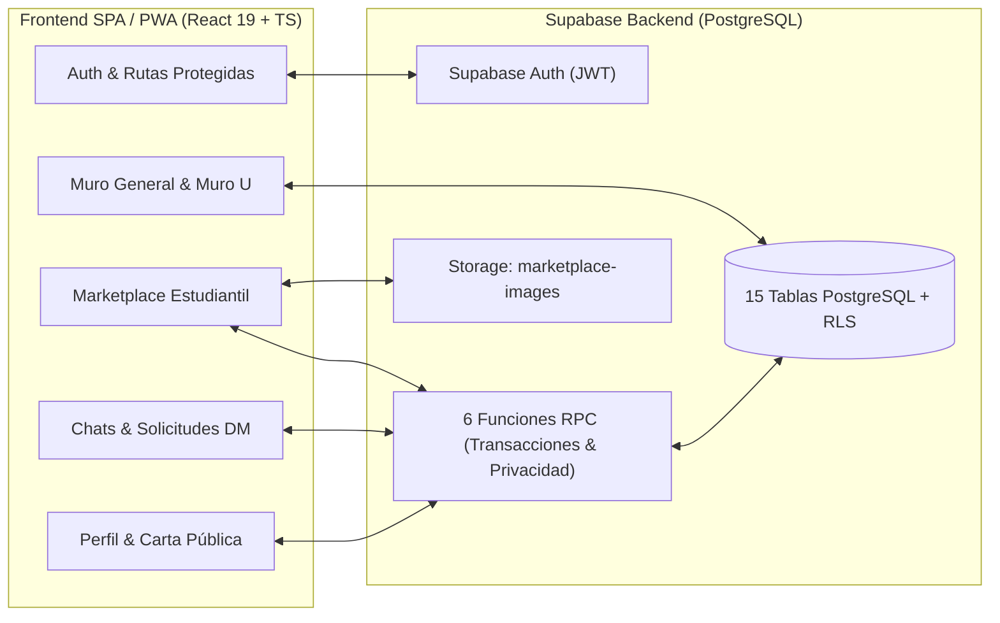

<div align="center">

# 🎓 Enlace U

**Red social comunitaria, foro interuniversitario y marketplace estudiantil para las universidades públicas de Costa Rica.**

[](https://enlaceu.online/auth)
[](https://github.com/Mangelbarboza/enlace-u/actions)
[](https://react.dev/)
[](https://www.typescriptlang.org/)
[](https://tailwindcss.com/)
[](https://supabase.com/)
[](https://enlaceu.online/auth)

<p align="center">
  <a href="https://enlaceu.online/auth"><strong>🌐 Ver Aplicación en Producción (enlaceu.online)</strong></a> ·
  <a href="./docs/ARCHITECTURE.md"><strong>📐 Arquitectura y Base de Datos</strong></a>
</p>

</div>

---

## 📌 Descripción del Proyecto

**Enlace U** es una plataforma web **Mobile-First & Progressive Web App (PWA)** diseñada para conectar a estudiantes y funcionarios de las instituciones de educación superior pública de Costa Rica (**UCR, TEC, UNA, UNED, UTN e INA**) a lo largo de las 7 provincias del país.

El proyecto centraliza en una sola experiencia instalable tres necesidades reales de la vida universitaria:
1. **Comunidad e Interacción Académica:** Un **Muro General** interuniversitario y un **Muro U** exclusivo por institución, con soporte para publicaciones públicas o anónimas, encuestas interactivas en tiempo real, filtrado por hashtags (`#tags`) y comentarios.
2. **Economía Estudiantil (Marketplace):** Un espacio dedicado para publicar productos, servicios, tutorías y emprendimientos estudiantiles (venta única o por encargo), con galería de imágenes en la nube y filtros por provincia e institución.
3. **Mensajería Privada con Control Anti-Spam:** Sistema de chats directos 1-a-1 protegido mediante **solicitudes previas con asunto** e integración transaccional directa desde las publicaciones del Marketplace.

---

## 📱 Capturas de Pantalla (Producción Mobile-First)

| Arranque PWA | Muro & Encuestas | Marketplace Estudiantil | Chats & Solicitudes | Perfil & Privacidad |
| :---: | :---: | :---: | :---: | :---: |
|  |  |  |  |  |
| *Instalable como app nativa (`standalone`)* | *Votación en tiempo real, likes y comentarios* | *Filtros por provincia/U y galería en Storage* | *Solicitudes de DM e intenciones de compra* | *Control granular de datos académicos y contacto* |

---

## 🚀 Aspectos Técnicos Destacados (Engineering Highlights)

Este proyecto fue construido priorizando **seguridad en el backend, rendimiento de consultas y experiencia de usuario móvil**:

- 🔒 **Privacidad Opt-In Gobernada por el Servidor (PostgreSQL RPCs):**
  Los usuarios deciden mediante interruptores independientes si desean mostrar su biografía (`show_bio`), su carrera/cargo (`show_academic_info`) o sus redes de contacto (`show_contact_info`: WhatsApp, Instagram, TikTok). En lugar de filtrar estos datos en el cliente, la carta pública de perfil ([`ProfileCard.tsx`](./src/components/ProfileCard.tsx)) consume el procedimiento almacenado `get_public_profile_card`, garantizando que los datos privados nunca viajen por la red.
- 🛡️ **Flujo de Mensajería Anti-Spam y Trazabilidad:**
  Nadie puede enviar mensajes directos no solicitados. Para iniciar un chat desde un post o comentario ([`DirectMessageRequestModal.tsx`](./src/components/DirectMessageRequestModal.tsx)), el remitente envía una solicitud con asunto (`create_direct_message_request`) que registra el origen (`source_post_id` / `source_comment_id`). Solo cuando el receptor acepta (`respond_direct_message_request`), el backend aprovisiona la sala de chat 1-a-1.
- 🛒 **Marketplace con Cooldown Transaccional de 12 Horas:**
  Al tocar *"Me interesa"* en un artículo o servicio ([`Marketplace.tsx`](./src/pages/Marketplace.tsx)), la función RPC `marketplace_start_purchase_chat` registra la intención de compra (`marketplace_purchase_intents`), abre o reutiliza la conversación con el vendedor, envía el mensaje automático de interés y aplica un **bloqueo de 12 horas por artículo** para evitar spam repetitivo al vendedor.
- ⚡ **Hidratación Paralela (`Promise.all`) y Caché por Alcance:**
  El motor de muros ([`Wall.tsx`](./src/components/Wall.tsx)) evita el problema de consultas $N+1$ hidratando en paralelo likes, comentarios, encuestas, opciones y votos sobre lotes paginados (`PAGE_SIZE = 15`), manteniendo además una caché en memoria diferenciada entre el muro general y el muro universitario para navegación instantánea entre pestañas.
- 🕵️ **Modo Anónimo con Moderación Activa e Integridad Institucional:**
  Permite crear publicaciones anónimas en los muros ocultando la identidad y bloqueando la apertura de perfil en la UI, pero preservando las reglas de moderación (`post_reports`) y borrado por autoría. Además, implementa bloqueo temporal de cambio de universidad (`university_locked_until`) para proteger la privacidad del **Muro U** de cada institución.
- 📲 **Arquitectura PWA Nativa:**
  Incluye Web App Manifest ([`manifest.webmanifest`](./public/manifest.webmanifest)), Service Worker propio ([`sw.js`](./public/sw.js)) con caché de *App Shell* y fallback offline para rutas SPA, y modo inmersivo ([`appLikemode.ts`](./src/lib/appLikemode.ts)).

---

## 🏗️ Arquitectura del Sistema

> 📄 **Documentación completa:** Para ver el **Diagrama Entidad-Relación (15 tablas)**, el catálogo detallado de las **6 funciones RPC de PostgreSQL** y las decisiones de diseño (ADRs), consultá [**`docs/ARCHITECTURE.md`**](./docs/ARCHITECTURE.md).



---

## 🛠️ Stack Tecnológico

| Categoría | Tecnologías Implementadas |
| :--- | :--- |
| **Frontend Core** | React `19.2`, TypeScript `6.0`, Vite `8.0` |
| **Enrutamiento & Estado** | React Router `8.0` (Layouts anidados, `ProtectedRoute`, `PublicOnlyRoute`), Context API (`AuthContext`) |
| **Estilos & UI** | Tailwind CSS `4.3` (`@tailwindcss/vite`), Lucide React Icons, Diseño Responsivo Mobile-First |
| **Backend & Base de Datos** | Supabase (`@supabase/supabase-js`), PostgreSQL, Row Level Security (RLS), Procedimientos Almacenados (PL/pgSQL RPCs) |
| **Almacenamiento Multimedia** | Supabase Storage (Bucket `marketplace-images` con validación de tamaño/MIME y aislamiento por usuario/artículo) |
| **PWA & Despliegue** | Service Worker API (`CacheStorage` + Offline Navigation Fallback), Web App Manifest, Cloudflare (`enlaceu.online`) |
| **Calidad de Código & CI** | ESLint `10`, TypeScript Strict Mode (`noUnusedLocals`, `noUnusedParameters`), GitHub Actions CI |

---

## 📂 Estructura del Proyecto

```text
enlace-u/
├── .github/workflows/
│   └── ci.yml                             # Pipeline CI: Lint + Typecheck + Vite Production Build
├── docs/
│   ├── ARCHITECTURE.md                    # Diagrama ER (15 tablas), catálogo de RPCs y ADRs
│   └── screenshots/                       # Capturas reales de la aplicación en producción
├── public/
│   ├── manifest.webmanifest               # Configuración PWA Standalone (orientación, íconos, colores)
│   └── sw.js                              # Service Worker (App Shell cache & SPA offline fallback)
├── src/
│   ├── components/
│   │   ├── AppLayout.tsx                  # Shell responsivo (Sidebar en Desktop / Bottom Nav en Mobile)
│   │   ├── DirectMessageRequestModal.tsx  # Modal para enviar solicitud previa de mensaje directo
│   │   ├── PostDetailModal.tsx            # Vista expandida de publicación, encuesta y árbol de comentarios
│   │   ├── ProfileCard.tsx                # Carta pública de usuario consumiendo RPC segura
│   │   ├── ProtectedRoute.tsx             # Guard de rutas autenticadas
│   │   ├── PublicOnlyRoute.tsx            # Guard de rutas públicas (/auth)
│   │   └── Wall.tsx                       # Motor compartido de Muro General y Muro Universitario
│   ├── context/
│   │   └── AuthContext.tsx                # Proveedor reactivo de sesión JWT con Supabase Auth
│   ├── lib/
│   │   ├── appLikemode.ts                 # Ajustes de experiencia táctil e inmersiva tipo app nativa
│   │   ├── constants.ts                   # Catálogo de universidades públicas, provincias y roles
│   │   ├── registerServiceWorker.ts       # Registro del Service Worker en el ciclo de carga
│   │   └── supabase.ts                    # Inicialización tipada del cliente Supabase
│   ├── pages/
│   │   ├── AuthPage.tsx                   # Login, registro con validaciones y recuperación de clave
│   │   ├── Chats.tsx                      # Gestión de solicitudes de DM y mensajería 1-a-1
│   │   ├── General.tsx                    # Vista del Muro General interuniversitario
│   │   ├── Marketplace.tsx                # Catálogo, publicación con imágenes e intención de compra
│   │   ├── Profile.tsx                    # Edición de perfil, privacidad granular y solicitud de baja
│   │   └── UniversityWall.tsx             # Vista del Muro exclusivo por institución del usuario
│   ├── App.tsx                            # Definición declarativa de rutas de la aplicación
│   └── main.tsx                           # Punto de entrada, hidratación de proveedores y PWA
├── .env.example                           # Plantilla de variables de entorno requeridas
├── eslint.config.js                       # Configuración Flat Config de ESLint + TypeScript
├── package.json                           # Dependencias y scripts de construcción
└── vite.config.ts                         # Configuración de compilación con Vite y Tailwind CSS v4
```

---

## ⚙️ Instalación y Ejecución Local

### 1. Prerrequisitos
- **Node.js** `v20+` (recomendado `v22 LTS`) y **npm**.
- Un proyecto en [Supabase](https://supabase.com/) (o las credenciales públicas del entorno de desarrollo).

### 2. Clonar el repositorio e instalar dependencias
```bash
git clone https://github.com/Mangelbarboza/enlace-u.git
cd enlace-u
npm install
```

### 3. Configurar las variables de entorno
Copiá el archivo de plantilla `.env.example` hacia `.env.local` y completá las llaves de tu proyecto de Supabase:
```bash
cp .env.example .env.local
```

Contenido de `.env.local`:
```env
VITE_SUPABASE_URL=https://tu-proyecto-id.supabase.co
VITE_SUPABASE_ANON_KEY=tu-supabase-anon-public-key
```

### 4. Iniciar el servidor de desarrollo
```bash
npm run dev
```

### 5. Comandos de verificación y producción
```bash
# Ejecutar análisis estático de código (ESLint)
npm run lint

# Verificar tipos con TypeScript y generar bundle optimizado en dist/
npm run build

# Previsualizar el build de producción localmente
npm run preview
```

---

## 👨‍💻 Autor

Desarrollado por **Angel Barboza Reyes**
- **GitHub:** [@Mangelbarboza](https://github.com/Mangelbarboza)
- **Producción:** [https://enlaceu.online](https://enlaceu.online/auth)
