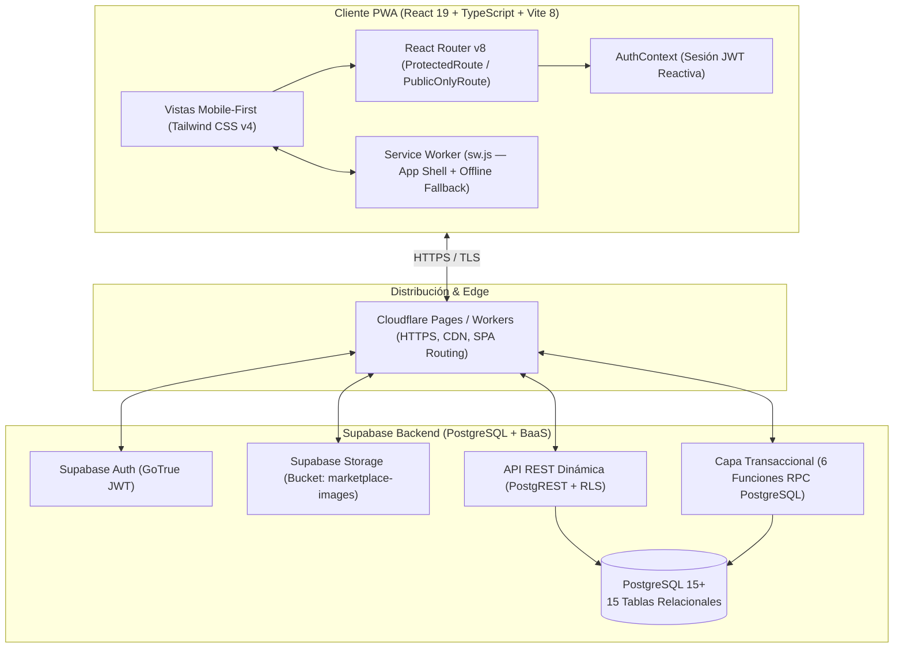
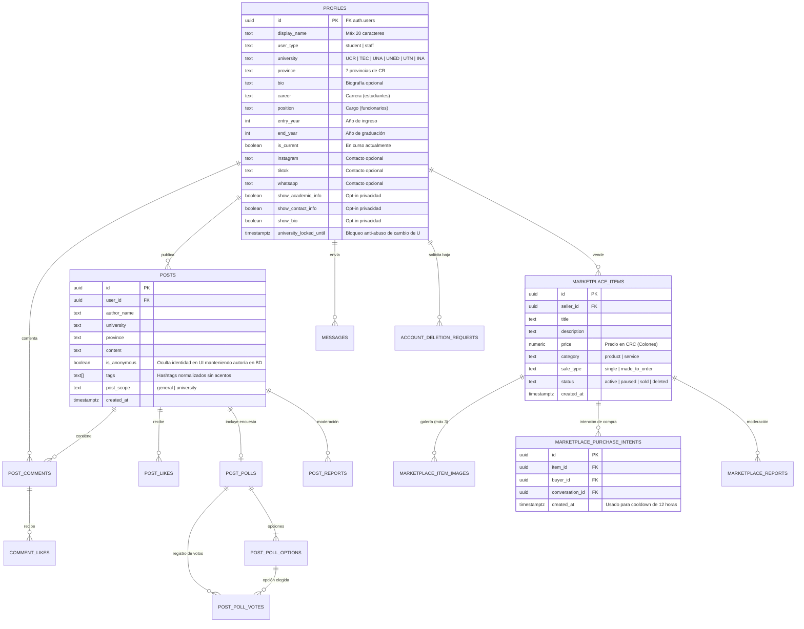

# Arquitectura Técnica y Modelo de Datos — Enlace U

Este documento detalla las decisiones de ingeniería, el diseño de base de datos relacional en **PostgreSQL (Supabase)**, la capa de procedimientos almacenados (**RPCs**) y las estrategias de rendimiento y seguridad implementadas en **Enlace U**.

---

## 1. Arquitectura General del Sistema

**Enlace U** sigue una arquitectura **Serverless / BaaS (Backend-as-a-Service)** donde el cliente **React 19 + TypeScript** opera como una **Progressive Web App (PWA)** distribuida en el Edge a través de **Cloudflare**, delegando la persistencia, autenticación, almacenamiento de objetos y reglas transaccionales de negocio a **Supabase (PostgreSQL)**.

---

## 2. Modelo Entidad-Relación (Base de Datos PostgreSQL)

El esquema relacional consta de **15 tablas** divididas en cuatro dominios funcionales:
1. **Identidad y Perfiles** (`profiles`, `account_deletion_requests`)
2. **Comunidad y Muros** (`posts`, `post_likes`, `post_comments`, `comment_likes`, `post_polls`, `post_poll_options`, `post_poll_votes`, `post_reports`)
3. **Marketplace Estudiantil** (`marketplace_items`, `marketplace_item_images`, `marketplace_purchase_intents`, `marketplace_reports`)
4. **Mensajería Directa 1-a-1** (`direct_message_requests`, `conversations`, `messages`)

---

## 3. Capa de Procedimientos Almacenados (Funciones RPC)

Para evitar que la lógica sensible dependa de validaciones en el navegador, las operaciones multi-tabla o sujetas a políticas de privacidad se ejecutan mediante **6 funciones RPC en PostgreSQL**:

| Función RPC | Archivo que la consume | Propósito Técnico y de Seguridad |
| :--- | :--- | :--- |
| `get_public_profile_card(profile_user_id)` | [`src/components/ProfileCard.tsx`](../src/components/ProfileCard.tsx) | Retorna únicamente los campos públicos del usuario evaluando en el servidor las banderas `show_academic_info`, `show_contact_info` y `show_bio`. Evita filtrar WhatsApp o redes sociales por red si el usuario las ocultó. |
| `create_direct_message_request(...)` | [`src/components/DirectMessageRequestModal.tsx`](../src/components/DirectMessageRequestModal.tsx) | Crea una solicitud de chat validando que no exista una solicitud pendiente duplicada entre ambos usuarios y registrando la trazabilidad (`source_post_id` / `source_comment_id`). |
| `get_my_dm_requests()` | [`src/pages/Chats.tsx`](../src/pages/Chats.tsx) | Obtiene en una sola consulta hidratada las solicitudes de mensaje directo tanto recibidas (`direction = 'received'`) como enviadas (`direction = 'sent'`) junto con los metadatos universitarios de la contraparte. |
| `respond_direct_message_request(request_id, decision)` | [`src/pages/Chats.tsx`](../src/pages/Chats.tsx) | Transacción atómica: si `decision = 'accepted'`, actualiza el estado de la solicitud, aprovisiona (o reutiliza) la sala de conversación directa y retorna el `conversation_id`. |
| `get_my_direct_conversations()` | [`src/pages/Chats.tsx`](../src/pages/Chats.tsx) | Lista las conversaciones activas del usuario autenticado incluyendo el último mensaje (`last_message`, `last_message_at`) y los datos públicos del interlocutor. |
| `marketplace_start_purchase_chat(target_item_id)` | [`src/pages/Marketplace.tsx`](../src/pages/Marketplace.tsx) | Valida que el artículo esté activo, verifica el **cooldown de 12 horas** para prevenir spam al vendedor, registra el `marketplace_purchase_intent`, abre/recupera la conversación directa e inserta el mensaje inicial de interés por el artículo. |

---

## 4. Decisiones Clave de Ingeniería (ADRs)

### 4.1. Hidratación Paralela (`Promise.all`) y Caché Instantáneo en Muros
En [`src/components/Wall.tsx`](../src/components/Wall.tsx), cargar publicaciones junto con sus conteos de likes, comentarios, likes de comentarios, encuestas, opciones y votos del usuario actual podría generar un problema de consultas $N+1$.
- **Solución:** Una vez obtenida la página de `posts` (`PAGE_SIZE = 15`), se extraen los `postIds` y se disparan las consultas de `post_likes`, `post_comments` y `post_polls` en paralelo mediante `Promise.all`, seguidas de una segunda fase paralela para `comment_likes`, `post_poll_options` y `post_poll_votes`.
- Adicionalmente, se mantiene una caché en memoria por ámbito (`wallCache` para `general` y `university`) que permite transiciones instantáneas entre pestañas sin parpadeos de carga (`loading skeleton`), refrescando bajo demanda o al mutar datos.

### 4.2. Anonimato Responsable y Bloqueo Temporal de Institución
- **Posts Anónimos:** Cuando un usuario publica con `is_anonymous = true`, la interfaz oculta su nombre, inicial, universidad y deshabilita la apertura de su `ProfileCard` o el envío de solicitudes de mensaje directo desde ese post, pero conserva la referencia interna para permitir reportes de moderación (`post_reports`) y que el propio autor pueda eliminar su publicación.
- **Integridad del Muro Universitario (`university_locked_until`):** Para evitar que usuarios cambien constantemente de universidad en su perfil con el fin de espiar o publicar en muros exclusivos de otras instituciones (`/muro-u`), el sistema implementa un bloqueo temporal tras modificar la institución académica.

### 4.3. Optimización de Imágenes y Almacenamiento en Marketplace
En [`src/pages/Marketplace.tsx`](../src/pages/Marketplace.tsx):
- Se restringe la subida a un máximo de **3 imágenes por publicación** (`MAX_IMAGES = 3`) y **1 MB por archivo** (`MAX_IMAGE_SIZE = 1024 * 1024`), validando MIME types y tamaños en el cliente antes de consumir ancho de banda hacia el bucket `marketplace-images` de Supabase Storage.
- Las rutas de almacenamiento siguen el patrón determinista `${user.id}/${itemId}/${timestamp}-${index}.${ext}` para aislar los archivos por usuario y artículo en políticas de Storage RLS.

### 4.4. Experiencia Nativa PWA (`App-Like Mode`)
- **Service Worker ([`public/sw.js`](../public/sw.js)):** Implementa precaching del *App Shell* (`/`, `/manifest.webmanifest`, `/icon.svg`), estrategia *Network-First con fallback a `/`* para peticiones de navegación (`request.mode === 'navigate'`) permitiendo que las rutas de React Router funcionen incluso ante micro-cortes de red móvil, y *Cache-First* para activos estáticos del mismo origen.
- **Modo Inmersivo ([`src/lib/appLikemode.ts`](../src/lib/appLikemode.ts)):** Desactiva la traducción automática forzada del navegador (`translate="no"`) y bloquea el menú contextual nativo fuera de campos `input`/`textarea` para brindar una sensación táctil idéntica a una app nativa en Android e iOS.
